# PGTerra

A declarative Infrastructure as Code tool for PostgreSQL databases, similar to Terraform but specifically designed for database schema management.

## 🔍 Overview

PGTerra follows a declarative approach where you define your **desired database state** in a `schema.sql` file, and the tool automatically figures out what changes are needed to bring your database to that state. No more writing manual migration scripts - just describe what you want and let PGTerra handle the rest!

### Key Concepts

- **Declarative, Not Imperative**: You describe WHAT you want, not HOW to get there
- **State-Based Management**: Compare current vs desired state and generate minimal changes
- **Safety First**: Preview changes with `plan` before applying them
- **Idempotent Operations**: Running the same schema multiple times is safe

## 🏗️ How It Works


### Architecture Components

#### 1. **Schema Parser**

- Converts your `schema.sql` file into structured objects
- Uses `sql-parser-cst` for robust SQL parsing
- Handles CREATE TABLE statements with columns, constraints, and data types

#### 2. **Database Inspector**

- Queries the current database structure using PostgreSQL's `information_schema`
- Extracts table definitions, column details, constraints, and metadata
- Normalizes database state into the same format as parsed schema

#### 3. **Schema Differ**

- Compares desired vs current state
- Generates optimized migration plan with proper operation ordering
- Handles complex scenarios like type conversions, constraint changes, and data preservation

#### 4. **Migration Planner & Executor**

- Orchestrates the diffing process safely
- Executes SQL statements with proper error handling
- Provides detailed feedback on changes applied

## 🔄 Step-by-Step Process


## 📝 Simple Example

Let's walk through a simple example to see how PGTerra works:

### Starting Point: Empty Database

```sql
-- Database has no tables
```

### Define Desired State: `schema.sql`

```sql
CREATE TABLE users (
    id SERIAL PRIMARY KEY,
    email VARCHAR(255) NOT NULL,
    name VARCHAR(100) NOT NULL,
    created_at TIMESTAMP DEFAULT NOW()
);
```

### Run Plan Command

```bash
pgterra plan
```

**Output:**

```
📋 Analyzing schema changes...
📝 Found 1 change(s) to apply:

1. CREATE TABLE users (id SERIAL PRIMARY KEY, email VARCHAR(255) NOT NULL, name VARCHAR(100) NOT NULL, created_at TIMESTAMP DEFAULT NOW());
```

### Apply Changes

```bash
pgterra apply
```

**Result:** The `users` table is created in your database.

## 🔄 Schema Evolution Example

Now let's modify the existing table:

### Current Database State:

```sql
CREATE TABLE users (
    id SERIAL PRIMARY KEY,
    email VARCHAR(255) NOT NULL,
    name VARCHAR(100) NOT NULL,
    created_at TIMESTAMP DEFAULT NOW()
);
```

### Update Desired State: `schema.sql`

```sql
CREATE TABLE users (
    id SERIAL PRIMARY KEY,
    email VARCHAR(255) NOT NULL,
    full_name VARCHAR(200) NOT NULL,    -- renamed and expanded
    created_at TIMESTAMP DEFAULT NOW(),
    is_active BOOLEAN DEFAULT true      -- new column
);
```

### Generated Migration Plan:

```sql
ALTER TABLE users ADD COLUMN full_name VARCHAR(200) NOT NULL;
ALTER TABLE users ADD COLUMN is_active BOOLEAN DEFAULT true;
ALTER TABLE users DROP COLUMN name;
```

**PGTerra automatically:**

- Detected the new `full_name` column
- Added the new `is_active` column with default
- Removed the old `name` column
- Preserved all existing data

## 🛠️ Advanced Features

### Smart Type Conversions

When changing column types, PGTerra automatically handles complex conversions:

```sql
-- Before: age VARCHAR(10)
-- After:  age INTEGER

-- Generated migration:
ALTER TABLE users ALTER COLUMN age TYPE INTEGER USING age::INTEGER;
```

### Constraint Management

PGTerra intelligently handles constraint changes:

```mermaid
flowchart TD
    A["Column Modification"] --> B["Drop Conflicting Defaults"]
    B --> C["Change Data Type"]
    C --> D["Set New Default"]
    D --> E["Add/Drop NOT NULL"]

    F["Complex Example:"] --> G["VARCHAR → INTEGER<br/>with new DEFAULT"]
    G --> H["1. DROP DEFAULT"]
    H --> I["2. ALTER TYPE USING"]
    I --> J["3. SET DEFAULT"]
    J --> K["4. SET NOT NULL"]
```



### Operation Ordering

The differ carefully orders operations to avoid conflicts:

1. Drop conflicting defaults
2. Change data types (with USING clauses when needed)
3. Set new defaults
4. Modify NULL/NOT NULL constraints

## 🚀 Installation & Usage

### Prerequisites

- Node.js 18+ with Bun package manager
- PostgreSQL database
- Database connection configured

### Installation

```bash
bun install
```

### Commands

#### Plan Changes

Preview what changes would be made without applying them:

```bash
bun run cli plan
```

#### Apply Changes

Execute the planned changes:

```bash
bun run cli apply
```

#### Use Custom Schema File

```bash
bun run cli plan --file custom-schema.sql
bun run cli apply --file custom-schema.sql
```

### Configuration

Create a configuration file (e.g., `pgterra.config.json`):

```json
{
  "database": {
    "host": "localhost",
    "port": 5432,
    "database": "myapp",
    "username": "postgres",
    "password": "password"
  }
}
```

## 📁 Project Structure

```
pgterra/
├── src/
│   ├── cli/
│   │   └── commands/          # CLI command handlers
│   ├── core/
│   │   ├── database/          # Database connection & client
│   │   ├── migration/         # Migration planning & execution
│   │   └── schema/            # Schema parsing, inspection, diffing
│   ├── types/                 # TypeScript type definitions
│   └── utils/                 # Shared utilities
├── schema.sql                 # Your database schema definition
└── README.md
```

## 🔧 Technical Deep Dive

### Schema Differ Logic

The `SchemaDiffer` contains the most sophisticated logic:


### Data Structure

Tables and columns are represented as TypeScript interfaces:

```typescript
interface Column {
  name: string;
  type: string;
  nullable: boolean;
  default?: string;
  primary?: boolean;
}

interface Table {
  name: string;
  columns: Column[];
}
```

## 🎯 Design Principles


## 🚦 Current Status & Roadmap

## Core Schema Objects

- [ ] **Tables**

  - Creation, alteration, dropping
  - Ownership, storage parameters, comments

- [ ] **Columns**

  - Creation, alteration (data type, default, nullability)
  - Dropping, NOT NULL/NULL, default values, collations, comments

- [ ] **Indexes**

  - Creation, alteration (REINDEX), dropping
  - Types: B-tree, GIN, GiST, BRIN, Hash
  - Unique, partial, expression, concurrent creation, storage parameters

- [ ] **Constraints**
  - [ ] **Primary Keys**: Creation, composite
  - [ ] **Foreign Keys**: Creation, ON DELETE/ON UPDATE actions (CASCADE, RESTRICT, SET NULL), DEFERRABLE
  - [ ] **Unique Constraints**: Creation
  - [ ] **Check Constraints**: CHECK clauses

---

## Advanced Schema Objects & Features

- [ ] **Sequences**

  - Creation, alteration (start, increment, min/max, cycle), dropping
  - Column ownership

- [ ] **Views**

  - Standard and Materialized: creation, OR REPLACE, dropping
  - Refresh for materialized views

- [ ] **Functions/Procedures (Routines)**

  - Creation, alteration (OR REPLACE), dropping
  - Language (PL/pgSQL, SQL), parameters, return types, volatility, security

- [ ] **Triggers**

  - Creation, enabling/disabling, dropping
  - BEFORE/AFTER/INSTEAD OF
  - FOR EACH ROW/STATEMENT
  - Event types: INSERT, UPDATE, DELETE, TRUNCATE
  - WHEN clause

- [ ] **Domains**

  - Creation, alteration, dropping
  - Underlying type, constraints

- [ ] **Enums (Enumerated Types)**

  - Creation, adding values

- [ ] **Composite Types**

  - Defining custom data structures

- [ ] **Extensions**

  - Enabling/disabling PostgreSQL extensions

- [ ] **Rules**

  - Creation, dropping

- [ ] **Collation Sequences**

  - Creating custom collations

- [ ] **Event Triggers**
  - Triggers on DDL events

---

## Database-Level Configuration & Management

- [ ] **Roles/Users and Permissions (Grants)**

  - Creation, alteration, dropping roles/users
  - Password management
  - Granting/revoking privileges on objects
  - Role memberships

- [ ] **Schemas (Namespaces)**

  - Creation, alteration, dropping
  - Ownership, search path

- [ ] **Tablespaces**

  - Creation, alteration, dropping

- [ ] **Database Properties**

  - Encoding, locale, connection limits, template database

- [ ] **Comments/Descriptions**
  - Associating comments with various database objects
