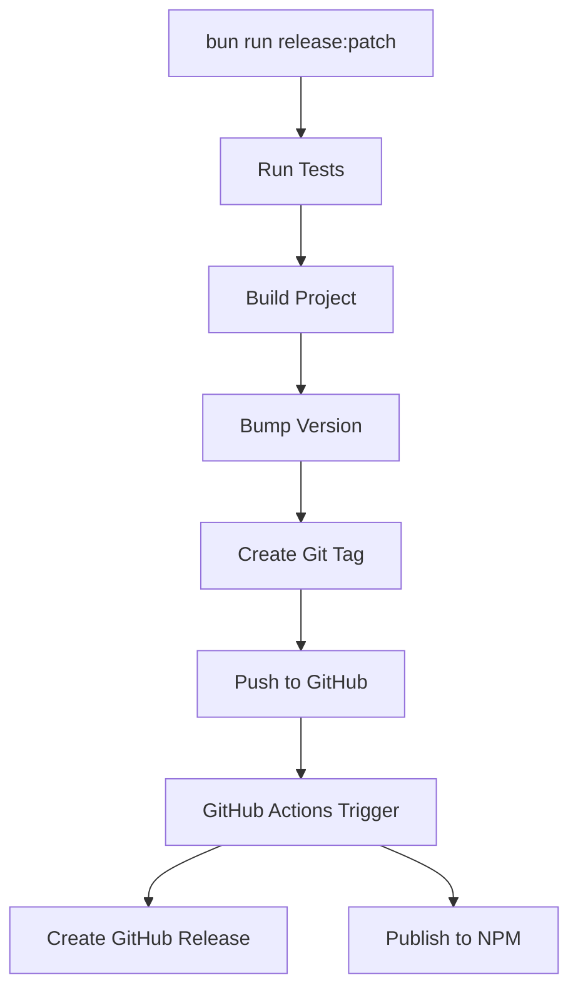

# Release Process

This document outlines the automated release process for Terra.

## Quick Start

To create a new release:

```bash
# For bug fixes (0.1.0 → 0.1.1)
bun run release:patch

# For new features (0.1.0 → 0.2.0)
bun run release:minor

# For breaking changes (0.1.0 → 1.0.0)
bun run release:major
```

## What Happens Automatically

### 1. Release Script (`scripts/release.ts`)
- ✅ Validates you're on `main` branch
- ✅ Ensures working directory is clean
- ✅ Pulls latest changes from remote
- ✅ Runs tests to ensure everything works
- ✅ Builds the project
- ✅ Bumps version in `package.json`
- ✅ Creates git tag (e.g., `v0.1.1`)
- ✅ Pushes changes and tag to GitHub

### 2. GitHub Actions (`.github/workflows/release.yml`)
- ✅ Triggers on new git tags (`v*`)
- ✅ Runs tests with PostgreSQL database
- ✅ Builds the project
- ✅ Creates GitHub Release with auto-generated changelog
- ✅ Publishes to npm registry

## Prerequisites

### For Maintainers
1. **NPM Token**: Add `NPM_TOKEN` secret to GitHub repository
   - Go to https://www.npmjs.com/settings/tokens
   - Create a new "Automation" token
   - Add it as `NPM_TOKEN` in GitHub repo secrets

### For Contributors
No special setup needed - all automation runs in CI.

## Release Flow



## Manual Release (Emergency)

If automation fails:

```bash
# 1. Create GitHub release manually
gh release create v0.1.1 --generate-notes

# 2. Publish to npm manually (if GitHub Actions fails)
bun run build
npm publish
```

## Rollback

If you need to rollback a release:

```bash
# Unpublish from npm (within 24 hours)
npm unpublish terra@0.1.1

# Delete GitHub release
gh release delete v0.1.1

# Delete git tag
git tag -d v0.1.1
git push origin --delete v0.1.1
```

## Version Strategy

- **Patch** (`0.1.0 → 0.1.1`): Bug fixes, documentation updates
- **Minor** (`0.1.0 → 0.2.0`): New features, non-breaking changes
- **Major** (`0.1.0 → 1.0.0`): Breaking changes, API changes

## Troubleshooting

### Release Script Fails

**Tests fail:**
```bash
# Fix the failing tests first
bun test
# Then retry release
bun run release:patch
```

**Build fails:**
```bash
# Fix build issues first
bun run build
# Then retry release
bun run release:patch
```

**Not on main branch:**
```bash
git checkout main
git pull origin main
bun run release:patch
```

### GitHub Actions Fails

Check the Actions tab in GitHub repository for detailed logs:
https://github.com/elitan/terra/actions

**Common issues:**
- Missing `NPM_TOKEN` secret
- npm package name conflict
- Test failures in CI environment

## Monitoring Releases

- **GitHub Releases**: https://github.com/elitan/terra/releases
- **NPM Package**: https://www.npmjs.com/package/terra
- **GitHub Actions**: https://github.com/elitan/terra/actions